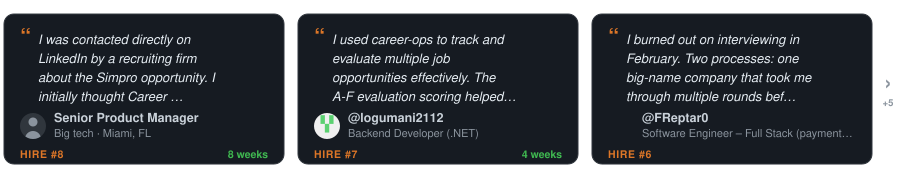

<p align="center"><picture><source media="(prefers-color-scheme: dark)" srcset="docs/wordmark-dark.svg"></picture></p>

<div align="center">

[English](README.md) | [Español](README.es.md) | [Deutsch](README.de.md) | [Français](README.fr.md) | [Português (Brasil)](README.pt-BR.md) | [한국어](README.ko-KR.md) | [日本語](README.ja.md) | [简体中文](README.cn.md) | [繁體中文](README.zh-TW.md) | [Українська](README.ua.md) | [Русский](README.ru.md) | [Polski](README.pl.md) | [Dansk](README.da.md) | [العربية](README.ar.md) | [हिन्दी](README.hi.md)

</div>

<p align="center">
  <a href="https://x.com/santifer"></a>
</p>

<p align="center">
  <em>我花了好幾個月用最費力的方式找工作。所以我打造了一個當初就希望能擁有的系統。</em><br>
  企業用 AI 篩選候選人。<strong>我把 AI 交給候選人，讓他們來<em>挑選</em>企業。</strong><br>
  <em>現在，它開源了。</em>
</p>

<hr>

<p align="center">
  <a href="HIRED.md"></a>
</p>

<p align="center"><sub>你也上岸了嗎？<a href="https://github.com/career-ops-hq/career-ops/issues/new?template=i-got-hired.yml">分享你的故事 →</a> · 你的卡片會讓還在找的人看見：出路真的存在。</sub></p>

<p align="center">
  <a href="HIRED.md"></a>
</p>

<p align="center"><sub>每一個數字都是一則公開的故事，你可以<a href="HIRED.md">親自查證 →</a> · 他們每一個人，都曾站在你現在的位置。</sub></p>

<p align="center">
  <a href="https://trendshift.io/repositories/25195" target="_blank"></a>
  &nbsp;&nbsp;
  <a href="https://www.producthunt.com/products/santifer-io?utm_source=badge-featured&utm_medium=badge" target="_blank"></a>
</p>

<p align="center"><sub>媒體報導</sub></p>

<p align="center">
  <a href="https://wired.com.gr/article/to-ai-ergaleio-pou-fernei-epanastasi-ston-tropo-pou-psachnoume-douleia/" rel="noopener noreferrer nofollow"><picture><source media="(prefers-color-scheme: dark)" srcset="docs/press/wired-dark.svg"></picture></a>
  &nbsp;&nbsp;&nbsp;&nbsp;&nbsp;
  <a href="https://www.businessinsider.com/how-i-built-tool-filter-job-listings-landed-head-ai-2026-4" rel="noopener noreferrer nofollow"><picture><source media="(prefers-color-scheme: dark)" srcset="docs/press/business-insider-dark.svg"></picture></a>
</p>

---

<p align="center">
  
</p>

<p align="center"><strong>評估超過 740 份職缺 · 生成超過 100 份個人化履歷 · 成功獲得理想職位</strong></p>

<p align="center"><sub>由 <a href="https://santifer.io">Santiago Fernández de Valderrama Aparicio</a>（<a href="https://github.com/santifer">@santifer</a>）建立並維護</sub></p>

<p align="center">
  <a href="https://discord.gg/8pRpHETxa4"></a>
  &nbsp;
  <a href="https://www.npmjs.com/package/@santifer/career-ops"></a>
</p>

<p align="center">
  <a href="https://claude.com/claude-code"></a>
</p>

<p align="center">
  <sub>同樣支援任何符合 agent-skill-standard 的 CLI</sub><br>
  
  
  
  
  
  
  <br>
  
  
  
  
  
  <a href="TRADEMARK.md"></a>
</p>

## 這是什麼

career-ops 能將任何 AI 程式碼 CLI 轉化為完整的求職指揮中心。不再需要手動用試算表追蹤應徵紀錄，而是獲得一個 AI 驅動的管道，能夠：

- **評估職缺** — 結構化的 A-H 評估報告（五個維度組成 1-5 的評分）
- **生成客製化 PDF** — 針對每份職缺描述進行 ATS 最佳化的履歷
- **自動掃描求職平台**（Greenhouse、Ashby、Lever、企業頁面）
- **批次處理** — 透過子代理並行評估 10 份以上的職缺
- **集中管理一切** — 單一資料來源，附完整性檢查

> **重要：這不是廣撒網的工具。** career-ops 是一個篩選器 — 它幫助你從數百份職缺中找出真正值得投入的少數機會。本系統強烈建議不要應徵評分低於 4.0/5 的職缺。你的時間很寶貴，招募人員的時間也是。送出前務必仔細審閱。

career-ops 具有代理能力：Claude Code 透過 Playwright 瀏覽求職頁面，藉由推理你的履歷與職缺描述的契合度（而非關鍵字比對）進行評估，並針對每份職缺調整你的履歷。

> **注意：最初幾次評估的品質可能不盡理想。** 因為系統還不了解你。請提供更多背景資訊 — 你的履歷、職涯故事、成就佐證、個人偏好、你的專長以及希望避免的事情。你餵給它的資訊越多，它就越準確。把它當作招募新人的招募顧問：第一週需要學習認識你，之後就會成為不可或缺的夥伴。

這個系統由一位親身使用它評估超過 740 份職缺、生成超過 100 份客製化履歷、並成功獲得 Head of Applied AI 職位的人所打造。[閱讀完整案例研究](https://santifer.io/career-ops-system)。

## CareerOps 宣言

career-ops 是 [CareerOps Manifesto](https://career-ops.org/manifesto?utm_source=readme) 的第一個參考實作。讀一讀，如果它說中了你的想法，就簽署它。你的簽署會成為一次 commit。

## 功能特色

| 功能             | 說明                                                                                                                   |
| ---------------- | ---------------------------------------------------------------------------------------------------------------------- |
| **自動管道**     | 貼上 URL，自動完成評估 + PDF + 追蹤紀錄                                                                                |
| **6 區塊評估**   | 職位摘要、履歷匹配、職級策略、薪酬調查、個人化、面試準備（STAR+R）— 另有 Block G 職缺正當性檢查，標記詐騙與幽靈職缺          |
| **面試故事庫**   | 跨評估累積 STAR+Reflection 故事 — 能回答任何行為面試問題的 5-10 個核心故事                                             |
| **薪資談判腳本** | 薪資談判框架、地區薪資折扣反駁話術、競爭 Offer 運用策略                                                                |
| **ATS PDF 生成** | 注入關鍵字的履歷，採用 Space Grotesk + DM Sans 設計                                                                    |
| **平台掃描器**   | 預設超過 45 家企業（Anthropic、OpenAI、ElevenLabs、Retool、n8n...）+ 跨 Ashby、Greenhouse、Lever、Wellfound 的自訂查詢 |
| **批次處理**     | 使用 `claude -p` 工作器並行評估                                                                                        |
| **儀表板 TUI**   | 在終端機 UI 中瀏覽、篩選及排序你的求職管道                                                                             |
| **人機協作**     | AI 負責評估與建議，你負責決策與行動。系統絕不送出應徵 — 最終決定永遠在你手上 <!-- hitl: absolute guarantee. Do not add "automatically", "by itself", "without your permission" or any other hedge when translating this row. -->                                       |
| **管道完整性**   | 自動合併、去重、狀態正規化、健康檢查                                                                                   |

## 快速開始

**最快的方式 — 一行指令：**

```bash
npx @santifer/career-ops init
```

> 💡 `npx` 隨 [Node.js](https://nodejs.org) 一起提供 — 它會執行安裝程式一次，
> 而不會在全域安裝任何東西。還沒有 Node？請先安裝它。
> （已經在使用 Claude Code / Gemini / Codex CLI？那你已經有了。）

這會把最新版本複製到 `./career-ops` 並安裝相依套件。接著：

```bash
cd career-ops
claude   # 或 gemini / codex / qwen / opencode — 在此開啟你的 AI CLI
```

**首次啟動時，career-ops 會透過對話帶你完成設定 — 你的履歷、個人檔案與目標職位 — 完全不需要手動編輯。**

<details>
<summary><b>偏好手動設定？（git clone）</b></summary>

```bash
git clone https://github.com/career-ops-hq/career-ops.git
cd career-ops && npm install
npx playwright install chromium   # 僅 PDF 生成所需
claude   # 開啟你的 AI CLI — 首次啟動時會帶你完成設定
```

</details>

> **這個系統設計上就是讓 Claude 來客製化的。** 模式、職位類型、評分權重、談判腳本 — 直接告訴 Claude 要修改什麼，它就會動手。Claude 讀取的是它自己使用的相同檔案，所以它確切知道要編輯哪裡。

完整設定指南請參閱 [docs/SETUP.md](docs/SETUP.md)。

## Antigravity CLI 整合

career-ops 原生支援 Antigravity CLI，方式與支援 Claude Code、OpenCode 相同。所有斜線指令都透過共用的 skill 進入點提供，使用的是同一套 `modes/*.md` 評估邏輯。

Google 已將消費者版的 Gemini CLI 存取轉移到 Antigravity CLI。`GEMINI.md` 現在只是一個不做任何事（no-op）的相容性防護檔，以免 Antigravity 同時讀取 `AGENTS.md` 與 `GEMINI.md` 時重複載入完整的專案指示。

### 原生 Antigravity CLI

```bash
# 1. Run in the career-ops directory
cd career-ops
agy

# 2. Use the unified /career-ops command with subcommands:
/career-ops "Senior AI Engineer at Anthropic..."
/career-ops pipeline
/career-ops scan
/career-ops pdf
/career-ops tracker
```

這個 skill 以開放標準定義在 `.agents/skills/career-ops/SKILL.md`，並為每個支援的 CLI 建立 symlink 或引用（例如 `.claude/`、`.cursor/`、`.qwen/`、`.antigravitycli/`、`.grok/`）。

## Codex 整合

career-ops 透過同一套共用路由支援 Codex，但它的呼叫方式與那些會自動註冊斜線指令的 CLI 不同。完整指南請參閱 [docs/CODEX.md](docs/CODEX.md)。

### 互動式 Codex

```bash
cd career-ops
codex
```

Codex 並不保證能使用斜線指令。如果 `/career-ops` 無法使用，就直接用自然語言請 Codex 執行對應的模式：

```text
Evaluate this JD with career-ops auto-pipeline: https://company.com/jobs/123
Run the career-ops scan mode and summarize new matches.
Run the career-ops pipeline mode for data/pipeline.md.
Run the career-ops pdf mode for the latest evaluated role.
Run the career-ops tracker mode and summarize the current statuses.
```

### 單次執行 Codex（`codex exec`）

```bash
codex exec "Evaluate this JD with career-ops auto-pipeline: https://company.com/jobs/123"
codex exec "Run career-ops scan mode in this repo and summarize new matches."
codex exec "Run career-ops pipeline mode for data/pipeline.md."
codex exec "Run career-ops pdf mode for the latest evaluated role."
codex exec "Run career-ops tracker mode and summarize the current statuses."
```

## Grok Build CLI 整合

career-ops 原生支援 Grok Build CLI，方式與支援 Claude Code、OpenCode 相同。`AGENTS.md` 會自動載入為專案規則，所有斜線指令都透過共用的 skill 進入點提供。

### 原生 Grok Build CLI

```bash
# 1. Run in the career-ops directory
cd career-ops
grok

# 2. Use the unified /career-ops command with subcommands:
/career-ops "Senior AI Engineer at Anthropic..."
/career-ops pipeline
/career-ops scan
/career-ops pdf
/career-ops tracker
```

若要以無介面的批次工作器執行，使用 `grok -p "prompt"`（加上 `--yolo` 可自動核准工具執行）。

### 獨立的 Gemini API 腳本（不需安裝 CLI）

```bash
# 1. Get a free API key at https://aistudio.google.com/apikey
cp .env.example .env
# Edit .env, set GEMINI_API_KEY=your_key_here

# 2. Install dependencies
npm install

# 3. Evaluate a job description
node gemini-eval.mjs "We are looking for a Senior AI Engineer..."
node gemini-eval.mjs --file ./jds/my-job.txt
node agent-inbox.mjs add "..."   # queue a request for the next session
npm run gemini:eval -- "JD text here"
```

> **免費方案：** 兩種方式都不需要開通付費。原生 CLI 使用 Google OAuth；API 腳本使用 `gemini-3.6-flash`（速率限制依模型與方案而異，目前的配額請見 Google AI 文件）。

## 使用方式

career-ops 是一個具有多種模式的單一斜線指令：

```
/career-ops                → 顯示所有可用指令
/career-ops {貼上職缺描述}  → 完整自動管道（評估 + PDF + 追蹤）
/career-ops scan           → 掃描平台尋找新職缺
/career-ops pdf            → 生成 ATS 最佳化履歷
/career-ops batch          → 批次評估多份職缺
/career-ops tracker        → 查看應徵狀態
/career-ops apply          → AI 協助填寫應徵表單
/career-ops pipeline       → 處理待辦 URL
/career-ops contacto       → LinkedIn 外寄訊息
/career-ops deep           → 深度公司研究
/career-ops training       → 評估課程/證照
/career-ops project        → 評估作品集專案
```

或者直接貼上職缺 URL 或描述 — career-ops 會自動偵測並執行完整管道。

## 運作原理

```
貼上職缺 URL 或描述
        │
        ▼
┌──────────────────┐
│  職位類型        │  分類：LLMOps / Agentic / PM / SA / FDE / Transformation
│  偵測            │
└────────┬─────────┘
         │
┌────────▼─────────┐
│  A-H 評估        │  匹配度、缺口、薪酬調查、STAR 故事
│  （讀取 cv.md）  │
└────────┬─────────┘
         │
    ┌────┼────┐
    ▼    ▼    ▼
  報告  PDF  追蹤
  .md  .pdf  .tsv
```

## 預設掃描平台

掃描器預設了超過 **45 家企業**及跨主要求職板的 **19 個搜尋查詢**。將 `templates/portals.example.yml` 複製為 `portals.yml` 並自行新增：

**AI 實驗室：** Anthropic、OpenAI、Mistral、Cohere、LangChain、Pinecone
**語音 AI：** ElevenLabs、PolyAI、Parloa、Hume AI、Deepgram、Vapi、Bland AI
**AI 平台：** Retool、Airtable、Vercel、Temporal、Glean、Arize AI
**客服中心：** Ada、LivePerson、Sierra、Decagon、Talkdesk、Genesys
**企業級：** Salesforce、Twilio、Gong、Dialpad
**LLMOps：** Langfuse、Weights & Biases、Lindy、Cognigy、Speechmatics
**自動化：** n8n、Zapier、Make.com
**歐洲：** Factorial、Attio、Tinybird、Clarity AI、Travelperk

**搜尋的求職平台：** Ashby、Greenhouse、Lever、Wellfound、Workable、RemoteFront

## 儀表板 TUI

內建的終端機儀表板讓你以視覺化方式瀏覽求職管道：

```bash
npm run serve:dashboard   # launch the TUI
npm run build:dashboard   # optional: build the standalone binary
```

功能：6 個篩選分頁、4 種排序模式、分組/平鋪檢視、延遲載入預覽、內嵌狀態修改。

## 專案結構

```
career-ops/
├── CLAUDE.md                    # 代理指令
├── cv.md                        # 你的履歷（需自行建立）
├── article-digest.md            # 你的成就佐證（選填）
├── config/
│   └── profile.example.yml      # 個人檔案範本
├── modes/                       # 14 個技能模式
│   ├── _shared.md               # 共用情境（在此自訂）
│   ├── oferta.md                # 單一職缺評估
│   ├── pdf.md                   # PDF 生成
│   ├── scan.md                  # 平台掃描器
│   ├── batch.md                 # 批次處理
│   └── ...
├── templates/
│   ├── cv-template.html         # ATS 最佳化履歷範本
│   ├── portals.example.yml      # 掃描器設定範本
│   └── states.yml               # 標準狀態清單
├── batch/
│   ├── batch-prompt.md          # 自包含工作器提示
│   └── batch-runner.sh          # 協調器腳本
├── dashboard/                   # Go TUI 管道檢視器
├── data/                        # 你的追蹤資料（已 gitignore）
├── reports/                     # 評估報告（已 gitignore）
├── output/                      # 生成的 PDF（已 gitignore）
├── fonts/                       # Space Grotesk + DM Sans
├── docs/                        # 設定、自訂化、架構說明
└── examples/                    # 範例履歷、報告、成就佐證
```

## 技術堆疊


- **代理**：Claude Code，附自訂技能與模式
- **PDF**：Playwright/Puppeteer + HTML 範本
- **掃描器**：Playwright + Greenhouse API + WebSearch
- **儀表板**：Go + Bubble Tea + Lipgloss（Catppuccin Mocha 主題）
- **資料**：Markdown 表格 + YAML 設定 + TSV 批次檔案

## 同樣開源

- **[cv-santiago](https://github.com/santifer/cv-santiago)** — 作者的作品集網站（santifer.io），包含 AI 聊天機器人、LLMOps 儀表板與案例研究。如果你需要一個在求職過程中展示的作品集，可以 fork 它並改造成你自己的。

## 常見問題（FAQ）

**career-ops 是什麼？**
career-ops 是一套開源、不綁定特定 CLI 的求職指揮中心。它把任何 AI 程式碼 CLI 變成一條管道：依你的 CV 評估職缺、產生適配 ATS 的 PDF、找出該聯絡的對象，並把所有進度集中追蹤——最終決定權仍在你手上。它是 CareerOps Manifesto 的第一個參考實作，詳見 [career-ops.org](https://career-ops.org)。

**我可以免費執行 career-ops，或改用較便宜／本地的模型嗎？**
可以。career-ops 不綁定特定 CLI，也能跑在免費與本地模型上——透過 OpenRouter 的免費模型、Ollama，或任何相容 OpenAI 的端點——所以你不必被付費訂閱綁住。完整設定見 [docs/RUNNING_ON_A_BUDGET.md](docs/RUNNING_ON_A_BUDGET.md)。

**我已經付費訂閱 Claude Pro/Max，為什麼 career-ops 還在燒 API 額度？**
因為環境變數中的 `ANTHROPIC_API_KEY` 優先於你已登入的訂閱：CLI 會改用這把金鑰，並按 token 計費。執行 `echo $ANTHROPIC_API_KEY`，若有印出任何內容，就把它從 shell 設定檔移除、重開終端機並執行 `/login`。批次模式是例外，因為 `claude -p` 的 worker 不會使用互動式登入：執行一次 `claude setup-token`，再把結果匯出為 `CLAUDE_CODE_OAUTH_TOKEN`。完整說明見 [docs/RUNNING_ON_A_BUDGET.md](docs/RUNNING_ON_A_BUDGET.md#2b-already-paying-for-a-subscription-make-sure-you-are-using-it)。

**career-ops 支援哪些 AI CLI？**
career-ops 可以跑在各主流 AI 程式碼 CLI 上——Claude Code、Codex、Gemini / Antigravity、OpenCode、Grok、Qwen 等——它透過開放的 Agent Skill Standard 運作，因此不會被單一廠商綁死。你手上已經有的 CLI 就能直接用。

**要怎麼在 Windows 上安裝 career-ops？**
career-ops 可以在 Windows 上執行。如果安裝過程中技能因 symlink 錯誤而載入失敗，解法在 [docs/FAQ.md](docs/FAQ.md)。完整步驟見 [docs/SETUP.md](docs/SETUP.md)。

**career-ops 會自動幫我投遞職缺嗎？**
不會。career-ops 是篩選器，不是亂槍打鳥的自動投遞工具。AI 負責評估、排序與草擬；審閱與決定由你來做。它不會替你送出、寄出或點擊任何東西——最終決定權永遠在你手上。這種保留人工把關的設計，正是整套系統的重點。

**career-ops 是免費且開源的嗎？**
是。career-ops 免費且開源，而且對求職者而言永遠都會是——它是 [CareerOps Manifesto](https://career-ops.org/manifesto) 的第一個參考實作。讀一讀，如果它說中了你的想法，就簽署它。

## 關於作者

我是 Santiago — Head of Applied AI，前創業者（創建並出售了一家至今仍以我名字營運的公司）。我打造 career-ops 是為了管理自己的求職過程，並成功用它找到了現在這份工作。

個人作品集與其他開源專案 → [santifer.io](https://santifer.io)

## Star 歷史

<a href="https://www.star-history.com/?repos=santifer%2Fcareer-ops&type=timeline&legend=top-left">
 <picture>
   <source media="(prefers-color-scheme: dark)" srcset="https://api.star-history.com/chart?repos=career-ops-hq/career-ops&type=timeline&theme=dark&legend=top-left" />
   <source media="(prefers-color-scheme: light)" srcset="https://api.star-history.com/chart?repos=career-ops-hq/career-ops&type=timeline&legend=top-left" />
   
 </picture>
</a>

## 免責聲明

**career-ops 是一個本地端開源工具 — 並非託管服務。** 使用本軟體即表示你確認：

1. **你掌控自己的資料。** 你的履歷、聯絡資訊和個人資料僅儲存於你的裝置上，並直接傳送至你所選擇的 AI 服務供應商（Anthropic、OpenAI 等）。我們不會收集、儲存或存取你的任何資料。
2. **你掌控 AI。** 預設提示詞已指示 AI 不要自動送出應徵，但 AI 模型的行為可能無法預測。如果你修改提示詞或使用不同的模型，風險由你自行承擔。**送出前務必確認 AI 生成內容的正確性。**
3. **你須遵守第三方服務條款。** 你必須依據你所操作的求職平台（Greenhouse、Lever、Workday、LinkedIn 等）的服務條款使用本工具。請勿使用本工具向雇主發送垃圾訊息或對 ATS 系統造成過多負擔。
4. **不提供任何保證。** 評估結果僅為建議，並非事實。AI 模型可能會產生幻覺，錯誤描述技能或經歷。作者對於任何就業結果、應徵被拒、帳號限制或其他後果概不負責。

詳細內容請參閱 [LEGAL_DISCLAIMER.md](LEGAL_DISCLAIMER.md)。本軟體依 [MIT 授權條款](LICENSE) 以「現狀」提供，不附帶任何形式的保證。

## 貢獻者

<a href="https://github.com/career-ops-hq/career-ops/graphs/contributors">
  
</a>

使用 career-ops 找到工作了嗎？[分享你的故事！](https://github.com/career-ops-hq/career-ops/issues/new?template=i-got-hired.yml)

## 授權條款

MIT

## 聯絡我

[](https://santifer.io)
[](https://linkedin.com/in/santifer)
[](https://x.com/santifer)
[](https://discord.gg/8pRpHETxa4)
[](mailto:hi@santifer.io)
